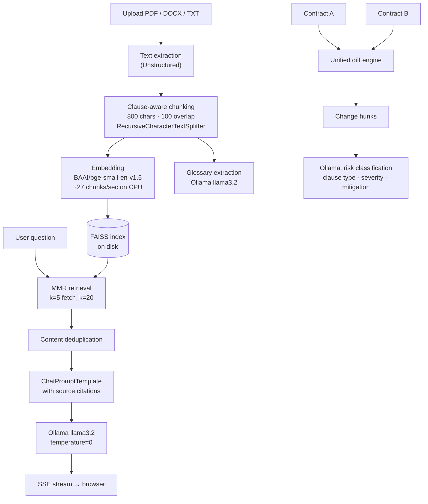

# Contrag

A local-first legal contract analysis platform. Upload contracts, chat with them using RAG, compare versions with diff analysis, and browse an auto-extracted legal glossary — all powered by a local LLM via Ollama.

## Features

- **Contract Chat** — Ask questions about your contracts using retrieval-augmented generation. Filter responses to specific source documents.
- **Diff Analysis** — Compare two contracts with four visualization modes: Unified, Side-by-Side, Redline, and Risk Analysis (LLM-powered per-change classification with clause type, severity, and mitigation advice).
- **Legal Glossary** — Legal terms are automatically extracted from uploaded contracts and stored in a searchable glossary.
- **Multi-format Support** — Upload PDF, DOCX, or TXT contracts.

## Prerequisites

- Python 3.10+
- [Ollama](https://ollama.com) running locally with the `llama3.2` model

```bash
ollama pull llama3.2
```

## Setup

```bash
git clone https://github.com/Rudra-J/contrag.git
cd contrag
python -m venv venv
venv/Scripts/activate       # Windows
# source venv/bin/activate  # macOS/Linux
pip install -r requirements.txt
```

## Running

```bash
cd backend
python -m uvicorn main:app --reload
```

Open [http://localhost:8000](http://localhost:8000).

## System Architecture



## Retrieval Design

**Chunking strategy:** `RecursiveCharacterTextSplitter` with clause-aware separators (`\nARTICLE`, `\nSECTION`, `\nWHEREAS`, etc.) tried first, falling back to paragraph → sentence → word boundaries. Chunk size is 800 characters with 100-character overlap (~12.5%) to preserve context across clause boundaries.

**Retrieval:** Maximal Marginal Relevance (MMR) — fetches 20 candidate chunks then re-ranks to balance relevance with diversity, preventing repetitive boilerplate from dominating the context window. Source filtering allows restricting retrieval to specific uploaded files.

**Deduplication:** Content hashes are checked before building the LLM prompt, discarding duplicate chunks that arise from re-uploads or overlap windows.

## Risk Analysis

The diff Risk Analysis mode classifies each change block across ten clause categories (payment terms, liability, indemnification, IP ownership, termination, governing law, confidentiality, representations, force majeure, other). Each change is annotated with:

- **Direction** — `risk_increase`, `risk_decrease`, or `neutral`
- **Severity** — `high`, `medium`, or `low` based on financial exposure and enforceability impact
- **Mitigation** — a concrete recommended action

## Performance

| Operation | Throughput / Latency |
|-----------|---------------------|
| Embedding (CPU) | ~27 chunks/sec · 37 ms/chunk |
| FAISS retrieval (MMR, k=5) | ~40–80 ms |
| Time to first token (llama3.2) | ~2–5 s (hardware dependent) |

Retrieval latency and chunk counts are logged to the backend console on each chat request.

## Tech Stack

| Layer | Technology |
|-------|-----------|
| Backend | FastAPI, LangChain, Ollama |
| LLM | llama3.2 (local via Ollama) |
| Embeddings | BAAI/bge-small-en-v1.5 (CPU) |
| Vector store | FAISS with MMR retrieval |
| Frontend | Vanilla JS, HTML/CSS |
| Document parsing | Unstructured |

## Running Tests

```bash
pytest
```
